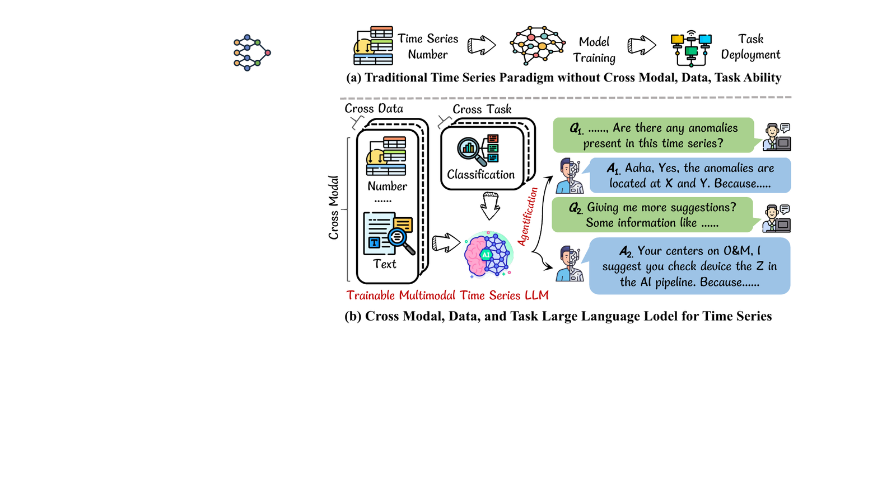
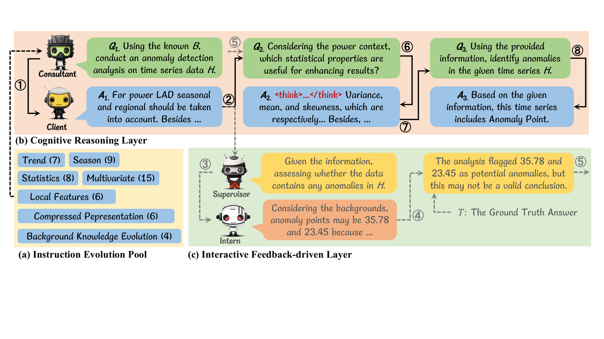
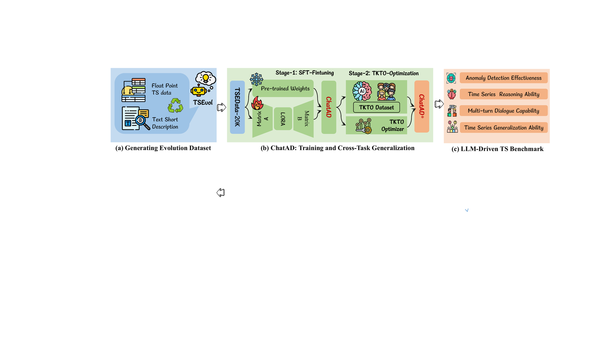
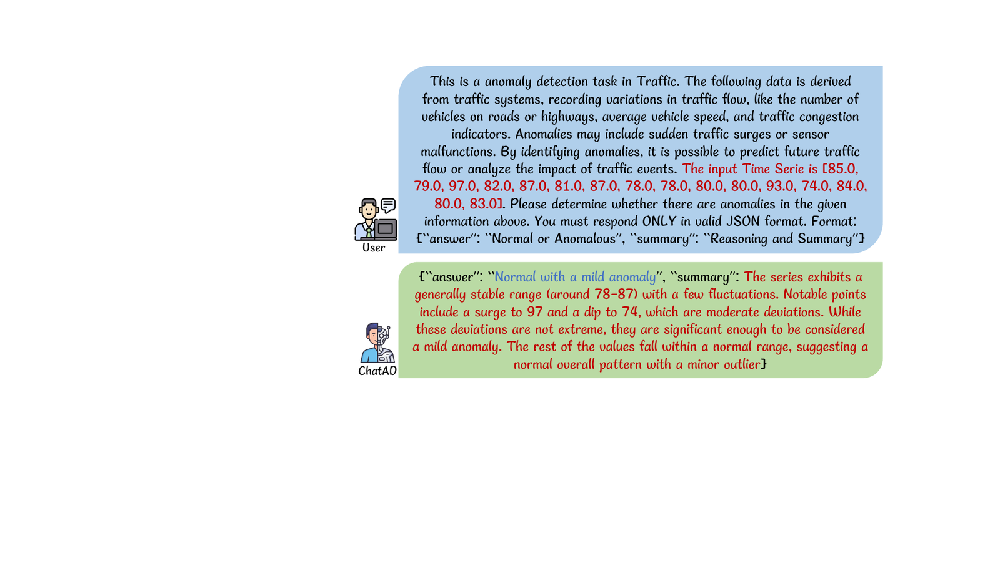

<div align="center">


# ChatAD: Reasoning-Enhanced Time-Series Anomaly Detection with Multi-Turn Instruction Evolution

[](https://www.python.org/)
[](https://pytorch.org/)
[](https://github.com/hiyouga/LLaMA-Factory)
[]()
[]()

*Turning time-series anomaly detection from a black-box classifier into an explainable, multi-turn conversation.*

[Overview](#-overview) • [Method](#-method) • [Dataset](#-tsedata-20k) • [Models](#-chatad-model-family) • [Benchmark](#-lladbench) • [Results](#-main-results) • [Quick Start](#-quick-start) • [FAQ](#-faq)

</div>

---

## 📣 News

- **[2026-07]** Initial anonymous code release for review: TSEvol pipeline, LLADBench evaluation suite, traditional baselines, and sample data shards.
- **[Upon acceptance]** Full TSEData-20K dataset, the three ChatAD model checkpoints, and the TKTO training recipes will be released.

## 🔍 Overview

**ChatAD** is a family of Multimodal Time Series Large Language Models (MTSLLMs) built for **reasoning-based anomaly detection (AD)** and **multi-turn diagnostic dialogue**. Existing LLM-driven AD methods suffer from limited reasoning proficiency, deficient multi-turn dialogue capability, and narrow cross-task generalization. ChatAD addresses all three with a complete data–model–optimization–benchmark stack:

<div align="center">

<br/><em>Traditional NN-based methods vs. the enhanced paradigm using an MTSLLM as a universal generator.</em>
</div>

**The four contributions of this repository:**

1. **TSEvol** — a multi-agent **T**ime-**S**eries instruction-**Evol**ution algorithm that evolves plain single-turn AD samples into verified, reasoning-rich multi-turn dialogues.
2. **TSEData-20K** — the first LLM-driven AD reasoning & multi-turn dialogue dataset: **10,011 dialogues / 21,303 turns across 8 domains**, distilled from a state-of-the-art reasoning teacher model and quality-controlled by TSEvol's verification agents.
3. **ChatAD model family + TKTO** — three fine-tuned MTSLLMs (ChatAD-Llama3-8B / -Qwen2.5-7B / -Mistral-7B), further optimized with **TKTO** (**T**ime-series **K**ahneman-**T**versky **O**ptimization) for cross-task generalization using unpaired binary feedback.
4. **LLADBench** — an **LL**M-driven learning-based **AD** **Bench**mark evaluating detection effectiveness, reasoning depth, multi-turn interaction, and cross-task / cross-dataset generalization against 9 LLM baselines and 15 traditional AD methods across 7 datasets.

## 🧠 Method

### TSEvol: Multi-Agent Instruction Evolution

TSEvol simulates a professional consulting workflow with four LLM agents that iteratively generate, answer, criticize, and verify questions grounded in the raw time series, its textual background, and the ground-truth label:

<div align="center">

</div>

| Agent | Role |
|---|---|
| 🧑‍💼 **Consultant** | Generates analytically valuable questions (Q₀ … Q₍ρ₋₁₎) along seven dimensions: trend, seasonality, statistics, local features, multivariate relationships, compressed representations, and background evolution |
| 🧑‍💻 **Client** | Produces candidate answers with explicit chain-of-thought reasoning |
| 🧑‍🎓 **Intern** | Independently assesses each answer against the ground truth |
| 🧑‍⚖️ **Supervisor** | Verifies the QA pair; only verified rounds are kept, otherwise the round is regenerated |

Every evolution run logs both the **raw inter-agent traffic** (`raw_data.csv`) and the **curated dialogue** (`conversation_data.csv`) that survived verification, so the entire data-construction process is auditable.

### Model Architecture

<div align="center">

</div>

Training proceeds in two stages on top of open-source backbones with LoRA adapters: **(i) SFT** on TSEData-20K to inject reasoning and multi-turn dialogue skills, then **(ii) TKTO** — a time-series adaptation of Kahneman-Tversky Optimization that leverages *unpaired* binary preference signals (readily available for TS tasks, unlike paired preference data) with an LLM-scored quality signal and a segmented mapping for boundary noise, pushing cross-task generalization without sacrificing AD accuracy.

## 📊 TSEData-20K

| Property | Value |
|---|---|
| Dialogues | 10,011 |
| Dialogue turns | 21,303 |
| Domains | 8 (AIOps, ECG, industry, IoT, web services, …) |
| Teacher model | GPT-5 (reasoning mode, chain-of-thought summaries retained) |
| Quality control | Intern + Supervisor dual verification in TSEvol |
| Format | LLaMA-Factory–compatible multi-turn conversations |

A sample evolved dialogue record (from `TSEvol/TSEvol_AD_Source_Part_11/*/conversation_data.csv`):

```json
{
  "id": 0,
  "rounds": 2,
  "conversations": [
    {"role": "Consultant", "content": "The following data represents ECG signals ... The input Time Series is [0.1, 0.13, ...]. For this series, do we observe ..."},
    {"role": "Client",     "content": "<think> Step-1: Calculating metrics ... </think> <answer> ... </answer>"},
    {"role": "Consultant", "content": "..."},
    {"role": "Client",     "content": "{\"answer\": \"Anomalous\", \"summary\": \"...\"}"}
  ]
}
```

This repository ships one source shard (`TSEvol/TSEvol_AD_Source_Part_11.json`), six example evolution logs, and the processed splits used by the traditional baselines (`Other_Results/Code/TSED_Train.json`, `TSED_Test.json`). The full dataset will be released upon acceptance.

## 🤖 ChatAD Model Family

| Model | Backbone | Stage | Checkpoint |
|---|---|---|---|
| ChatAD-Llama3-8B | Llama-3-8B-Instruct | SFT (LoRA) | upon acceptance |
| ChatAD-Qwen2.5-7B | Qwen2.5-7B-Instruct | SFT (LoRA) | upon acceptance |
| ChatAD-Mistral-7B | Mistral-7B-Instruct | SFT (LoRA) | upon acceptance |
| ChatAD\* | ChatAD-Qwen2.5-7B | SFT + **TKTO** | upon acceptance |

Training hyper-parameters (per the paper): LoRA-based SFT with AdamW, lr 5e-5, cosine schedule, batch size 4–8, 5 epochs, max context 8192, on NVIDIA A100 (80 GB) GPUs (~36–62 h per model).

## 🏆 LLADBench

LLADBench evaluates MTSLLMs along **four dimensions** over **7 datasets/tasks** — ANDE and TSEData for anomaly detection, OERQA for open-ended reasoning, and SGAD / FOREC / IMPUT / CLASS for cross-task generalization (segmentation-style AD on a contamination-free smart-grid set, forecasting, imputation, and classification):

1. **Detection effectiveness** — single-turn AD (Accuracy / Precision / Recall / F1 / FPR)
2. **Multi-turn interaction** — dialogue-based AD with context carry-over
3. **Reasoning depth** — open-ended QA scored by an LLM judge (OERQA: logic score LS, factual score FS)
4. **Cross-task / cross-dataset generalization** — zero-shot transfer to segmentation, forecasting, imputation, and classification

Baselines: 9 medium-sized open-source (M)TSLLMs (Llama3-8B-Instruct, Qwen2.5-7B-Instruct, Qwen3-8B, Mistral-7B-Instruct, DeepSeek-R1-Distill-{Llama3-8B, Qwen2.5-7B}, and the TimeMQA family) plus 15 traditional AD methods (Random Forest, XGBoost, LightGBM, OC-SVM, LOF, iForest, ECOD, COPOD, KNN, HBOS, AutoEncoder, LODA, VAE, DeepSVDD, Matrix Profile).

## 📈 Main Results

Single-turn AD on ANDE and multi-turn dialogue AD on TSEData (excerpt; full tables in the paper):

| Model | AD Acc ↑ | AD F1 ↑ | AD FPR ↓ | Multi-turn Acc ↑ | Multi-turn F1 ↑ | Multi-turn FPR ↓ |
|---|---:|---:|---:|---:|---:|---:|
| Random Forest (best traditional) | 89.89 | 89.79 | 7.73 | 95.63 | 96.80 | 3.07 |
| TimeMQA-Llama3-8B (best LLM baseline) | 70.42 | 67.15 | 18.59 | 75.77 | 77.38 | 33.74 |
| **ChatAD-Llama3-8B** | 75.79 | 74.82 | 19.17 | 82.38 | 83.96 | 27.70 |
| **ChatAD-Mistral-7B** | 90.54 | 90.31 | 5.79 | **96.46** | **96.32** | 3.90 |
| **ChatAD-Qwen2.5-7B** | **92.23** | **92.08** | **4.55** | 95.69 | 95.39 | **1.95** |
| **ChatAD\*** (+TKTO) | 92.23 | 92.03 | 5.18 | 96.07 | 95.83 | 2.19 |

**Highlights.** ChatAD improves over LLM baselines by up to **34.50% accuracy / 34.71% F1** with a **37.42% FPR reduction**, while — unlike traditional methods — retaining full reasoning and dialogue ability. With TKTO, ChatAD\* additionally achieves the best reasoning scores (OERQA LS 69.83 / FS 99.99) and leading cross-task generalization on segmentation, forecasting, imputation, and classification, at a negligible AD cost.

<div align="center">

<br/><em>ChatAD in action: interactive, explainable anomaly diagnosis.</em>
</div>

## 🚀 Quick Start

### 1. Installation

```bash
conda create -n chatad python=3.10 -y && conda activate chatad
git clone <anonymous-repo-url> ChatAD && cd ChatAD
pip install -r requirements.txt
```

### 2. Configure the backend LLM

TSEvol (teacher) and the OpenQA judge are provider-agnostic and read their configuration from environment variables:

```bash
# Azure OpenAI
export LLM_PROVIDER=azure
export AZURE_OPENAI_ENDPOINT=https://<your-resource>.openai.azure.com
export AZURE_OPENAI_API_KEY=<your-key>
export AZURE_OPENAI_API_VERSION=2025-03-01-preview
export LLM_DEPLOYMENT=<your-deployment-name>

# or any OpenAI-compatible endpoint
export LLM_PROVIDER=openai
export OPENAI_API_KEY=<your-key>
export OPENAI_BASE_URL=<optional-custom-base-url>   # optional
export LLM_DEPLOYMENT=<model-name>
```

### 3. Run TSEvol

```bash
cd TSEvol
python TSEvol.py \
  --data_path ./TSEvol_AD_Source_Part_11.json \
  --saved_path ./saved \
  --rounds 3
# resume an interrupted run:
#   --last_log_path ./saved/<timestamp>
```

### 4. Train ChatAD (SFT + TKTO)

Both stages run on [LLaMA-Factory](https://github.com/hiyouga/LLaMA-Factory). Register `TSED_Train.json` in LLaMA-Factory's `dataset_info.json` (multi-turn/sharegpt style), then launch LoRA SFT on your chosen backbone; the TKTO stage reuses the KTO trainer with the time-series scoring prompts provided in the paper's appendix. Full configs ship with the model release.

### 5. Evaluate on LLADBench

```bash
cd LLADBench

# single-turn AD metrics
python AD_Task_Evaluation.py \
  --input_dir <generated_predictions.jsonl> --output_dir <ad_results.json>

# multi-turn dialogue AD metrics
python Multi_Turn_Digo_AD_Task_Evaluation.py \
  --input_dir <generated_predictions.jsonl> --output_dir <dialog_results.json>

# open-ended reasoning QA (LLM-as-judge)
python OpenQA_Test_Using_LLM.py \
  --predicted_file <predictions.jsonl> \
  --ground_truth_file <OpenQA-Test.json> \
  --output_file <reasoning_results.json>
```

### 6. Reproduce the traditional baselines

```bash
cd Other_Results/Code
python Numerical_Based_Methods.py    # 15+ classical & NN-based AD methods
python Forecasting_Darts_Example.py  # forecasting environment sanity check
```

## 📁 Project Structure

```
ChatAD
├── assets/                            # figures & logo used in this README
├── TSEvol/                            # ① multi-agent instruction evolution
│   ├── TSEvol.py                      #    main evolution pipeline
│   ├── TSEvol_AD_Source_Part_11.json  #    sample source shard
│   ├── TSEvol_AD_Source_Part_11/      #    example evolution logs
│   └── utils/
│       ├── api_utils.py               #    env-configured LLM client
│       ├── person.py                  #    Consultant / Client / Intern / Supervisor
│       ├── prompts.py                 #    agent prompt templates
│       └── tools.py, log.py           #    parsing & logging utilities
├── LLADBench/                         # ④ benchmark & evaluation
│   ├── AD_Task_Evaluation.py          #    single-turn AD metrics
│   ├── Multi_Turn_Digo_AD_Task_Evaluation.py  # multi-turn metrics
│   └── OpenQA_Test_Using_LLM.py       #    LLM-as-judge reasoning scores
├── Other_Results/
│   ├── Code/                          #    traditional baselines & data prep
│   └── TAB/                           #    result tables
├── requirements.txt
└── README.md
```

## ❓ FAQ

<details>
<summary><b>Why do LLM outputs need an LLM judge for the reasoning task?</b></summary>
MTSLLM inputs mix free-form text with numerical data, so purely script-based parsing of open-ended answers exhibits systematic biases. LLADBench therefore scores open-ended QA with a strict LLM judge under a fixed rubric, while structured tasks (AD labels) are parsed by rules.
</details>

<details>
<summary><b>Can I use a different teacher model for TSEvol?</b></summary>
Yes. Set <code>LLM_DEPLOYMENT</code> to any reasoning-capable model exposed through the Responses API (or adapt <code>utils/api_utils.py</code> for chat-completions backends). Verification quality depends on the teacher's reasoning strength.
</details>

<details>
<summary><b>Why is Multi-turn FPR sometimes lower for traditional methods?</b></summary>
Traditional detectors are tuned per-dataset with full supervision and no dialogue ability; they serve as an effectiveness upper-reference. ChatAD matches or surpasses them while additionally supporting reasoning, dialogue, and zero-shot cross-task transfer — capabilities traditional methods lack entirely.
</details>

<details>
<summary><b>Where are the model weights and the full dataset?</b></summary>
To comply with double-blind review they are withheld during the review period and will be released together with the training configs upon acceptance.
</details>

## 📜 Citation

```bibtex
@inproceedings{chatad2027,
  title     = {ChatAD: Reasoning-Enhanced Time-Series Anomaly Detection with Multi-Turn Instruction Evolution},
  author    = {Anonymous},
  booktitle = {Under review},
  year      = {2026}
}
```

## ⚖️ License

Released for research and review purposes only. A full open-source license will accompany the camera-ready release.
